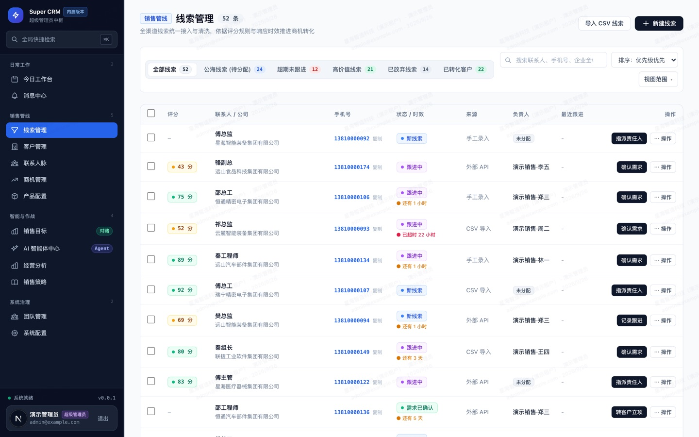
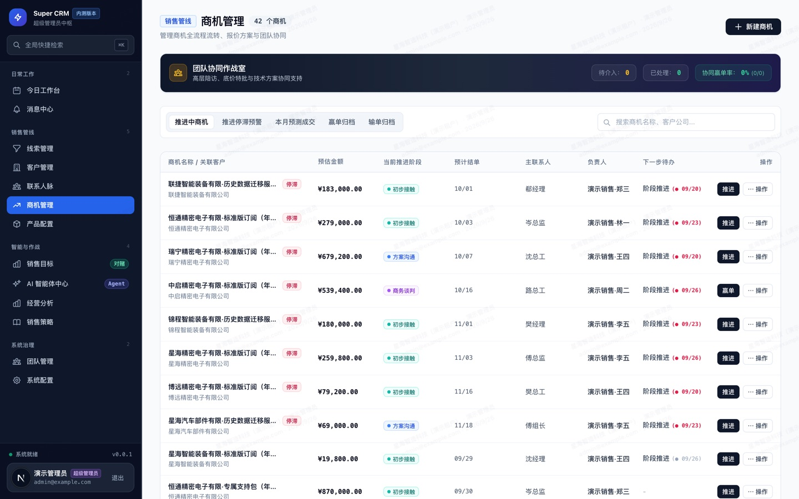
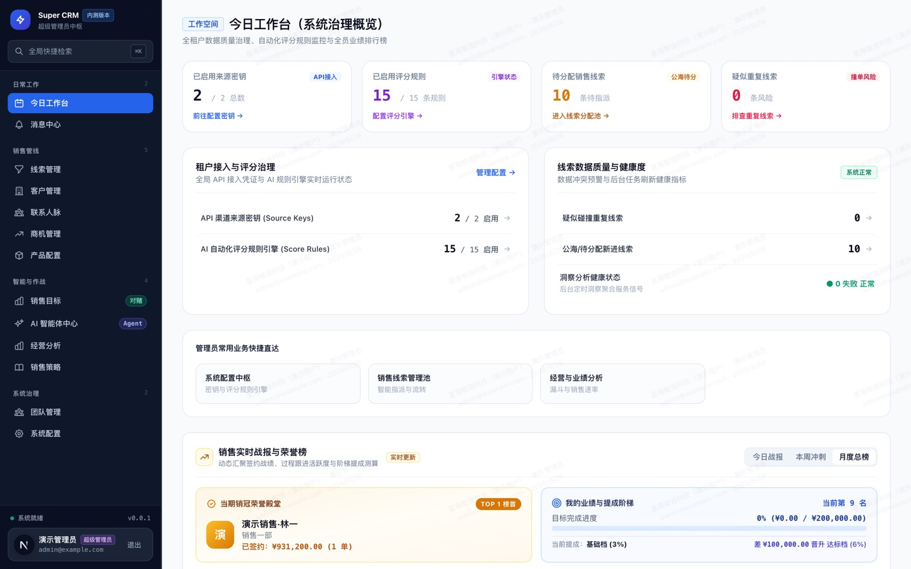
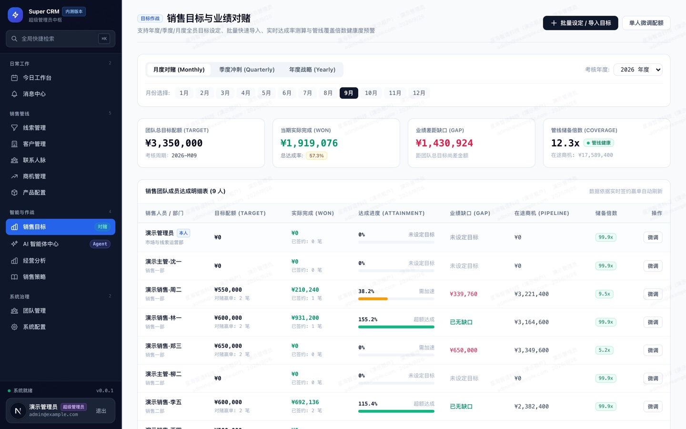
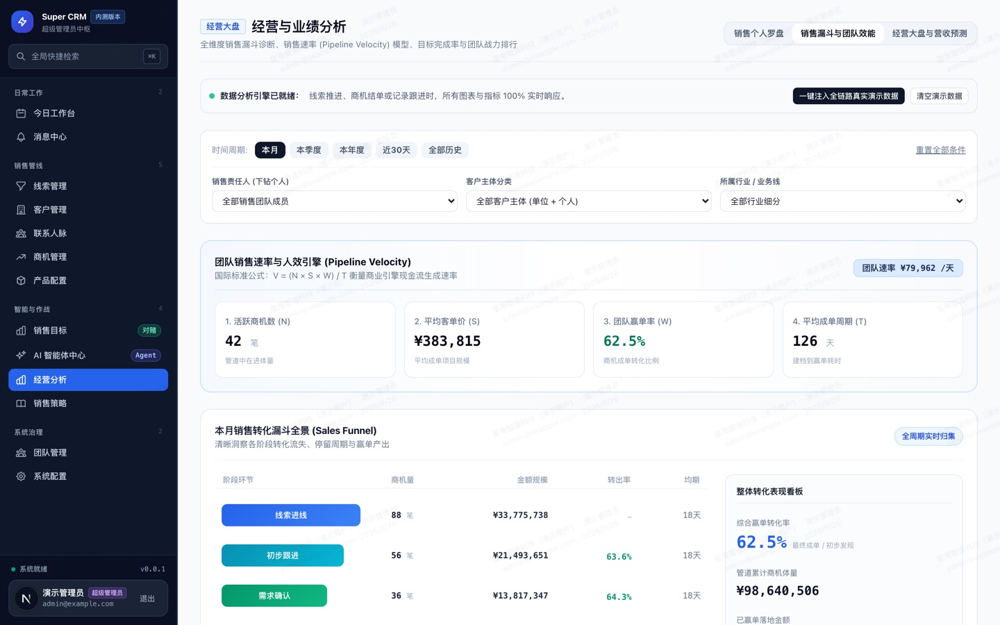
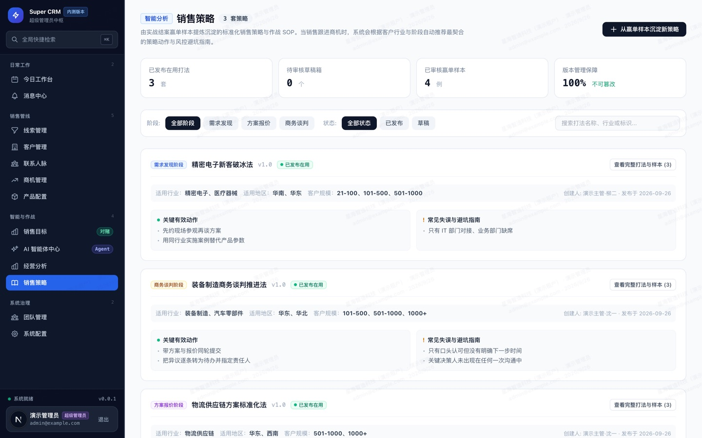

# Super CRM

**把销冠的打法沉淀成系统能力，在每一笔业务里给出可执行的下一步建议。**

Super CRM 是一套面向 20–100 人 B2B 销售团队的开源 CRM。它不满足于"记录发生了什么"——它回答销售每天真正关心的问题：**今天先跟谁、下一步做什么、为什么**。

[](https://github.com/Jimmyzxk/super-crm/actions/workflows/ci.yml)
[](./LICENSE)
[](#质量保障)
[](https://nextjs.org/)
[](https://www.postgresql.org/)

---

## 它解决什么问题

一线销售不愿填 CRM，是因为填单只对管理者有价值。Super CRM 的设计前提反过来：**先让销售得到好处**——打开系统就知道先联系谁、记跟进只要 30 秒、到点自动提醒——管理价值是这件事的副产品。

具体做法：

- **打开就知道先跟谁**：线索自动评分（0-100 可解释，附理由），每天生成排序好的工作队列。
- **30 秒记完一条跟进**：只需填「方式 / 结果 / 一句话」，系统自动提炼出结构化信息、生成下一步任务并排期。
- **超时了有人管**：任务到期、线索停滞、客户沉默都会触发提醒，不靠主管在例会上追问。

## 界面预览

> 以下截图来自本仓库的演示数据（`pnpm db:seed:demo` 一键生成），非设计稿。

**线索池 —— 评分、时效与责任人一目了然，超时线索自动标红**



**商机管理 —— 7 阶段推进、停滞预警与下一步待办**



**今日工作台 —— 每天先做什么，系统给出排序与依据**



**销售目标 —— 团队配额与达成进度**



**经营分析 —— 漏斗、赢单率与业绩趋势**



**打法库 —— 从真实赢单中沉淀可复用的方法**



## 核心能力

### 销售日常

| 能力 | 说明 |
|---|---|
| **线索治理** | 多渠道进线（手工 / CSV / 公开表单 / 外部 API）统一查重与评分；5 档冲突判定（他人私海强阻断 / 自己重复直达 / 公海一键认领 / 撞客拦截 / 放弃重激活） |
| **公海机制** | 无人跟进的线索按规则自动回收（`7 / 30 / 60 天` + 3 天保护期 + 临期预警），避免线索烂在个人手里 |
| **跟进与任务** | 极速录入 + 智能提炼，下一步自动排期；超时 / 临近判定与今日工作台四档排序（超时最前） |
| **智能评分** | 13 字段加权规则（8 类 operator）、权重可配、自动重算、销售可反馈准确 / 不准确 |
| **客户与联系人** | 单位 / 个人双轨、决策链 6 角色标签、主联系人唯一、线索历程穿透 |
| **商机管理** | 7 阶段推进（相邻校验、回退需原因）、赢 / 输单归档、报价行项目挂载自动回写总额、阶段停滞识别 |
| **通知与工作台** | 站内收件箱 + 任务到期提醒，扫描去重 + 并发安全（`SKIP LOCKED`） |

### AI 能力（真正的 Agent，不是套壳）

六个常驻 Agent 走完整的 **ReAct 循环**（推理 → 调用工具 → 观察 → 再推理，上限 8 轮），工具层直接复用业务 service，每次执行留痕可追溯：

| Agent | 做什么 |
|---|---|
| **晨会副驾驶** | 每天给对方销售生成"今天三件事"，每条附业务证据与一键建任务 |
| **推进质检** | 发现商机推进缺口：缺决策人 / 缺预算 / 缺时间线 / 无下一步 / 超期停滞 |
| **赢单 · 输单归因** | 从真实赢单样本中提炼为什么赢、为什么输 |
| **销冠解构** | 分析销冠客户画像与推进路径差异 |
| **企业画像** | 钱从哪来、谁在流失、增量在哪 |
| **管线健康巡检** | 主动发现风险商机与异常 |

**关于诚实的几个具体做法**（这是我们认为比"模型更强"更重要的部分）：

- 真实赢单样本不足 20 时，所有结论强制标注`方向性假设（低置信度，样本 N=x）`，不假装确定。
- 页面**不展示**模型的思维过程，只展示可核验的业务证据。
- AI 总开关关闭时 `fail-closed`：零外发请求，而不是静默降级成另一套说辞。
- 无 API Key / 超时 / 返回格式异常时降级到内置规则，不让用户卡住。

### 架构与工程

- **多租户硬隔离**：共享库 + PostgreSQL `FORCE ROW LEVEL SECURITY`，`withTenant` 事务内设置租户上下文；每张业务表都有对应的隔离测试。
- **插件化扩展**：核心保持对插件零依赖，插件通过白名单接口与核心交互。停用任何插件都不影响核心闭环。
- **行为级测试**：546 条测试全部是行为断言（真数据库、真服务、真 HTTP handler），不使用"源码里包含某字符串"这类假测试。零 skip。

## 快速开始

**前置条件**：Node.js 22、pnpm 9.15.5、Docker。

```bash
git clone https://github.com/Jimmyzxk/super-crm.git
cd super-crm

cp .env.example .env          # 开发默认值可直接用；生产请按注释用 openssl 生成强随机密钥
pnpm install
pnpm docker:dev               # 启动 PostgreSQL + 应用容器（代码改动即时生效）

# 数据库迁移：容器启动时已自动执行；宿主机直连时手动跑
pnpm db:migrate

# 演示数据（幂等，可重复执行）
pnpm db:seed:demo
```

打开 http://localhost:3000/login，用开发默认账号登录：

```
邮箱：admin@example.com
密码：password123
```

> 生产部署（含 HTTPS 证书终止、环境变量清单、备份与恢复演练、故障排查）见 **[部署运维手册](./docs/22-DEPLOYMENT-OPERATIONS.md)**。

## 技术栈

| 层 | 选型 |
|---|---|
| 框架 | Next.js 16（App Router）+ React 19 + TypeScript（strict） |
| 数据库 | PostgreSQL 17 + Drizzle ORM + Row Level Security |
| 样式 | Tailwind CSS |
| 测试 | Vitest（行为级：真实数据库与服务调用） |
| 部署 | Docker Compose（含 Caddy TLS 终止配置） |

## 质量保障

```bash
pnpm typecheck     # 类型检查，0 错误
pnpm lint          # 分层门禁 + ESLint，0 错误
pnpm test          # 546 条行为级测试（需 PostgreSQL）
pnpm build         # 生产构建
```

四项目前全部通过，CI 在每次 push 与 PR 时自动执行（见上方 badge）。

分层门禁是一项架构保护：核心代码（`src/core`）不允许导入插件（`src/plugins`），确保插件可以被自由替换或移除而不影响主体。

## 文档

| 文档 | 内容 |
|---|---|
| [产品定位](./docs/01-PRODUCT-OVERVIEW.md) | 目标用户、解决什么问题、V1 边界 |
| [角色与场景](./docs/02-USERS-AND-SCENARIOS.md) | 销售 / 主管 / 管理员各角色的一天 |
| [功能规格](./docs/03-FEATURE-LEAD.md) | 线索、跟进、评分、客户、商机、通知、设置（`docs/03`–`09`）|
| [页面与交互规格](./docs/10-UI-SPEC.md) | 界面结构、状态、校验与响应式规则 |
| [领域模型与数据字典](./docs/11-DOMAIN-AND-DATA.md) | 对象关系、多租户隔离、完整字段与索引 |
| [接口规格](./docs/12-API-SPEC.md) | Server Actions、Route Handlers、错误码 |
| [插件契约](./docs/13-PLUGIN-CONTRACT.md) | 插件如何与核心交互（扩展开发必读） |
| [技术架构](./docs/14-TECH-ARCHITECTURE.md) | 选型理由、目录结构、模块边界 |
| [测试规范](./docs/16-TEST-PLAN.md) | 测试哲学与用例设计原则 |
| [AI Agent 战略](./docs/21-AI-AGENT-HARNESS-STRATEGY.md) | Agent 循环、工具层、护栏的设计依据 |
| [部署运维手册](./docs/22-DEPLOYMENT-OPERATIONS.md) | 部署、环境变量、备份恢复、排障 |
| [产品介绍](./docs/23-PRODUCT-INTRODUCTION.md) | 一页纸概览 |

## 关于发行形态

本仓库是 **「主代码开源 + 业务插件闭源」** 的发行版：

- **包含**：完整核心 CRM、AI Agent 体系、插件框架（契约定义 / 装配点 / UI 挂载点 / 启停与限流表）。
- **不包含**：7 个业务插件的实现（合同、订单、交付项目、BI 矩阵、获客表单、知识库、智能分发）及其数据表——它们是闭源组件。

**插件缺席时系统完整可用**：导航不会出现幽灵入口，详情页挂载点与设置分区渲染为空，AI 报告中的插件相关段落为空——核心链路不受影响。这一降级行为有行为级测试锁定。

**二次开发挂载自己的插件**：在 `src/plugins/<your-plugin>/` 实现 `definePlugin({...})`，在 `src/plugin-kit/registry.ts` 的 `compiledPlugins` 里 import 并 push 即可，上游调用点无需任何改动。契约见 [插件契约](./docs/13-PLUGIN-CONTRACT.md)。

## 贡献

欢迎提交 issue 与 PR。开始之前请读 [CONTRIBUTING.md](./CONTRIBUTING.md)——其中说明了开发环境、代码规范、测试要求与提交约定。

要点：所有 PR 必须通过 `pnpm typecheck && pnpm lint && pnpm test`；新增业务逻辑需附带行为级测试。

## 许可证

[AGPL-3.0-only](./LICENSE) © 2026 Super CRM contributors

AGPL 与普通开源许可证的关键差异：**如果你把本程序的修改版作为网络服务提供给他人使用，你必须向这些使用者提供修改版的完整源码。** 自用或内部部署不受影响。
