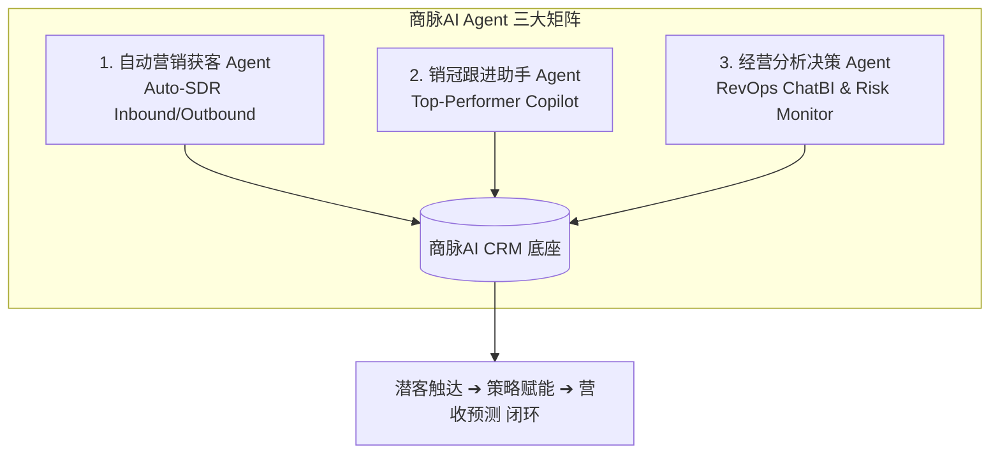

# 商脉AI CRM 产品全景架构、业务规则与操作教程手册 (Product Specification & Operations Manual)

> **品牌名称**：商脉AI CRM (Enterprise AI Sales Cloud)  
> **版本**：v1.3.0  
> **状态**：正式发布 (Production Standard)  
> **适用对象**：产品经理、销售业务团队、系统实施顾问、开发与运维工程师  
> **文档定位**：本手册为「商脉AI CRM」全业务规则、冲突判定模型、生命周期状态机、权限门禁与标准作业程序 (SOP) 的官方权威开放文档，供产品培训、操作教程制作与业务审计溯源使用。

---

## 目录
1. [产品定位与 L2C 业务全景图](#1-产品定位与-l2c-业务全景图)
2. [多渠道进线与全场景冲突判定规则矩阵](#2-多渠道进线与全场景冲突判定规则矩阵)
3. [单位客户 vs 个人客户双轨架构](#3-单位客户-vs-个人客户双轨架构)
4. [决策链多联系人角色标签体系](#4-决策链多联系人角色标签体系)
5. [一客多线索全景穿透与多商机协同](#5-一客多线索全景穿透与多商机协同)
6. [公海池治理与权限安全门禁](#6-公海池治理与权限安全门禁)
7. [UI/UX 设计系统与视觉规范](#7-uiux-设计系统与视觉规范)
8. [标准作业程序 (SOP) 实操教程](#8-标准作业程序-sop-实操教程)

---

## 1. 产品定位与 L2C 业务全景图

「商脉AI CRM」是一套面向现代 B2B 企业的 **AI-Native 全流程销售增长与客户生命周期管理平台**。系统围绕 **L2C (Lead-to-Cash，从线索到现金)** 核心链路，解决多渠道线索防撞单、多联系人复杂决策链、多商机协同推进与流失资产打捞等复杂业务痛点。

### 1.1 L2C 全生命周期核心动线
```
[外部API/表单插件/手动录入]
         │
         ▼
  [冲突与风险判定] ── 发现撞单/撞客 ──> [强阻断 / 引导认领 / 重新激活 / 重复打标]
         │ (无冲突 / 成功认领)
         ▼
    [新线索 NEW] ── 生成 24h 首响任务 ──> [销售记录跟进 CONTACTED]
                                                      │
                                                      ▼
                                            [需求确认 QUALIFIED]
                                                      │
                                                      ▼
                                            [转客户立项 CONVERTED]
                                       ┌──────────────┴──────────────┐
                                       ▼                             ▼
                              [新建单位/个人客户]            [关联追加至已有客户]
                                       │                             │
                                       └──────────────┬──────────────┘
                                                      ▼
                                              [立项商机 DISCOVERY]
                                                      │
                                                      ▼
                                              [方案报价 PROPOSAL]
                                                      │
                                                      ▼
                                              [商务谈判 NEGOTIATION]
                                                      │
                                       ┌──────────────┴──────────────┐
                                       ▼                             ▼
                                  [赢单 WON]                    [输单 LOST]
                                       │                             │
                                [触发赢单复盘]                 [沉淀输单原因分析]
                                [提炼销售打法库]
```

---

## 2. 多渠道进线与全场景冲突判定规则矩阵

为杜绝销售抢单、重复建客、客户主体碎片化与外部进线丢单问题，系统针对不同进线渠道建立了多层级判定模型：

### 2.1 冲突判定与业务规则全景矩阵

| 进线渠道 (Source) | 触发场景 (Scenario) | 判定类型 (Collision Type) | 业务规则与系统行为 (Business Rules & Action) | 前端交互与反馈 (UI Behavior) |
| :--- | :--- | :--- | :--- | :--- |
| **销售手动录入 (Manual)** | 录入手机号已在其他销售私海跟进中 | `ACTIVE_PRIVATE_LEAD` | **强阻断 (409 Conflict)**：杜绝抢单与客户冲突。普通销售严禁重复录入他人活跃线索。 | 阻断提交，明确提示：`“该线索已由销售 [姓名] 跟进中，无法重复录入私海。”` |
| **销售手动录入 (Manual)** | 录入手机号已在自己私海名下 | `SELF_LEAD` | **自重检测与直达引导**：避免销售自身名下生成重复冗余线索。 | 提示：`“您名下已有该线索 [联系人]，无需重复创建。”`，提供一键直达抽屉按钮。 |
| **销售手动录入 (Manual)** | 录入手机号在公海池中待分配 | `PUBLIC_POOL_LEAD` | **公海引导与直接认领**：提高公海资产转化，避免无序重复录入。 | 提示：`“该线索已在公海池中待认领。”`，弹窗内提供 `[ 直接认领入私海 ]` 按钮，点击后自动更新归属并派发 24 小时首响任务。 |
| **销售手动录入 (Manual)** | 录入手机号已是正式客户联系人 | `EXISTING_CUSTOMER_CONTACT` | **撞客拦截与客户聚合**：禁止将已成交/已立项客户降级拆分为孤立线索。 | 提示：`“该联系人已归属正式客户「[客户名称]」（负责人：[姓名]）。”`，提供 `[ 前往该客户档案 ]` 链接，引导直接追加商机。 |
| **销售手动录入 (Manual)** | 录入手机号为历史流失已放弃线索 | `DISCARDED_LEAD` | **流失线索重新激活**：盘活历史流失数据，给予二次开发机会。 | 提示：`“该联系人曾于历史跟进中标记放弃。”`，提供 `[ 重新激活并认领入私海 ]` 按钮，一键清空放弃原因，重置状态为 `NEW`，重新生成首响任务。 |
| **外部 API 接入 (`/api/v1/leads`)** | 官网投放/广告 Webhook 批量推送线索 | 命中已有活跃私海或客户联系人 | **不丢单 + 智能打标 + 审计溯源**：外部推送不可因冲突返回 4xx 导致数据丢失。 | 接口返回 `201 Created`（`replay: false, duplicateSuspected: true`），线索写入待分配池并打上疑似重复标签，记录碰撞类型供主管调度。 |
| **表单插件 / 落地页 (Form Capture)** | 访客在公开落地页提交表单 | 命中公海/私海或恶意高频刷单 | **IP/手机号频控防刷 + 碰撞自动打标**：保障公开接口安全。 | 严格频控限流（10次/分），自动进行电话与邮箱格式标准化，标记重复线索并记录来源表单 ID。 |

---

## 3. 单位客户 vs 个人客户双轨架构

B2B 业务中既存在大型企业主体，也存在个人高净值客户或独立顾问。系统采用双轨客户架构，支持精细化管理：

```
                    ┌─────────────────────────┐
                    │      客户主体 (Customer) │
                    └────────────┬────────────┘
                                 │
           ┌─────────────────────┴─────────────────────┐
           ▼                                           ▼
┌──────────────────────┐                   ┌──────────────────────┐
│ 单位客户 ENTERPRISE  │                   │ 个人客户 INDIVIDUAL   │
├──────────────────────┤                   ├──────────────────────┤
│ · 客户企业全称       │                   │ · 个人客户主体名称   │
│ · 所属行业分类       │                   │ · 所在地区           │
│ · 企业人员规模       │                   │ · 无需企业行业与规模 │
│ · 所在地区           │                   │ · 个人即为主联系人   │
│ · 多联系人决策链矩阵 │                   │ · 轻量快捷商机跟进   │
└──────────────────────┘                   └──────────────────────┘
```

### 3.1 属性与验证规则对照
| 字段 | 单位客户 (ENTERPRISE) | 个人客户 (INDIVIDUAL) | 规则与约束 |
| :--- | :--- | :--- | :--- |
| **主体名称 (`name`)** | 企业全称（如：`阿尔法重工科技有限公司`） | 个人主体名（如：`张总 (个人客户)`） | 必填，1-100 字符，同一租户内名称去重校验 |
| **所属行业 (`industry`)** | 选填（如：`智能制造 / 医疗健康`） | 自动隐藏脱敏 | 单位客户专用，最大 50 字符 |
| **人员规模 (`size`)** | 选填（`1-20` / `21-100` / `101-500` / `501-1000` / `1000+`） | 自动隐藏脱敏 | 单位客户专用枚举 |
| **所在地区 (`region`)** | 选填（如：`华东 / 上海市`） | 选填（如：`北京 / 朝阳`） | 最大 50 字符 |
| **联系人体系** | 需维护多联系人决策链 | 自动绑定当前个人为主联系人 | 任何客户名下必须至少有 1 名联系人 |

---

## 4. 决策链多联系人角色标签体系

B2B 复杂项目采购通常涉及多人决策链。系统在客户名下提供 6 大标准决策角色标签：

### 4.1 角色标签定义与业务场景
- **最终决策人 (`DECISION_MAKER`)**：
  - *角色职能*：公司高层、业务一把手或采购最终审批人，把控总预算与终审决策。
  - *视觉标签*：Amber 雅致徽章 (`bg-amber-50 text-amber-800 border-amber-200`)。
- **技术评估人 (`TECH_EVALUATOR`)**：
  - *角色职能*：CTO、架构师、技术总监或运维主管，负责产品技术可行性、PoC 验证与架构适配。
  - *视觉标签*：Blue 徽章 (`bg-blue-50 text-blue-800 border-blue-200`)。
- **商务采购 (`PROCUREMENT`)**：
  - *角色职能*：采购经理、商务总监或法务对接人，负责合同条款、商务比价、法务合规与付款协议谈判。
  - *视觉标签*：Indigo 徽章 (`bg-indigo-50 text-indigo-800 border-indigo-200`)。
- **实际使用人 (`USER`)**：
  - *角色职能*：一线业务主管、终端操作员，负责提出功能痛点、体验反馈与日常使用对接。
  - *视觉标签*：Emerald 徽章 (`bg-emerald-50 text-emerald-800 border-emerald-200`)。
- **财务对接人 (`FINANCE`)**：
  - *角色职能*：财务经理、会计出纳，负责付款申请、发票开具、款项对账与报销审核。
  - *视觉标签*：Purple 徽章 (`bg-purple-50 text-purple-800 border-purple-200`)。
- **其他协作人 (`OTHER`)**：
  - *角色职能*：外部咨询顾问、项目协作者、第三方合作伙伴。
  - *视觉标签*：Slate 徽章 (`bg-slate-100 text-slate-600 border-slate-200`)。

### 4.2 联系人完整性保护机制
1. **主联系人唯一性约束**：每个客户有且仅有 1 个主联系人 (`is_primary = true`)；设新主联系人时系统自动原子切换旧主联系人。
2. **删除保护机制**：
   - 客户名下仅剩 1 名联系人时，禁止删除（杜绝无联系人的“孤儿客户”）；
   - 主联系人不可直接删除，必须先将其他联系人指定为主联系人后方可删除原主联系人。

---

## 5. 一客多线索全景穿透与多商机协同

在成熟企业客户跟进中，同一家企业在不同年份、不同产品线会有多个部门发起线索。系统支持**一客多线索**与**一客多商机**的全景穿透：

### 5.1 线索转客户立项双模式
1. **新建客户主体模式 (`NEW`)**：
   - 适用于全新客户进线；
   - 录入企业/个人档案，设置首个联系人角色，联动创建首个商机项目。
2. **关联至已有客户模式 (`EXISTING`)**：
   - 适用于老客户二次进线或同一企业其他部门对接人进线；
   - 支持智能下拉搜索已有客户（若线索公司名与已有客户一致将自动智能预匹配）；
   - 转化后，线索对接人作为新联系人追加至该客户决策链，并直接建立该客户名下的新业务商机；
   - 全流程写入 `lead_conversions` 溯源链，保留全生命周期审计记录。

### 5.2 客户 360° 视图中的关联线索历程
客户详情页设有 **「关联线索历程 (Associated Leads History)」** 板块，穿透展示：
- 来源线索名称与联系电话；
- 进线接入时间；
- 孵化转化出的商机项目名称；
- 点击可直接穿透至历史线索详情或商机看板。

---

## 6. 公海池治理与权限安全门禁

### 6.1 角色权限矩阵 (RBAC)

| 业务操作 | 销售员 (SALES) | 销售主管 (MANAGER) | 系统管理员 (ADMIN) | 权限控制机制 |
| :--- | :---: | :---: | :---: | :--- |
| **查看私海线索/客户** | 仅自己负责 | 全部团队 | 全部团队 | 数据行级过滤 |
| **创建线索/客户/商机** | 允许 (受防撞单约束) | 允许 (可忽略撞单) | 允许 | API 契约校验 |
| **公海线索认领** | 允许 (受容量上限约束) | 允许 | 允许 | 并发乐观锁 |
| **线索/客户指派派单** | 禁止 | 允许 (跨销售指派) | 允许 | RBAC 阻断 |
| **删除客户档案** | **严格禁止 (菜单隐藏)** | 允许 (无进行中商机时) | 允许 | 前端隐藏 + API 首行校验 |
| **修改商机阶段** | 允许 (仅推进负责商机) | 允许 | 允许 | 防跳步状态机校验 |
| **管理 API 密钥/插件** | 禁止 | 禁止 | 允许 | ADMIN 专属 |

### 6.2 公海池强门禁规范
- **未归属公海资产门禁**：公海资产处于未分配状态 (`owner_user_id is null`) 时，**严禁展示“记录跟进”或“转客户立项”操作**；
- 强制遵循 **`先认领/指派 ➔ 建立归属责任 ➔ 方可开始跟进`** 标准规范。

---

## 7. UI/UX 设计系统与纯净亮色规范 (Light SaaS Design System)

为保持现代企业级 B2B 软件（Linear / Stripe 风格）的高质感、高可读性与零操作认知负荷，系统严格执行以下设计与交互标准：

### 7.1 统一纯净亮色主题与视觉层级 (Pure Light Palette)
1. **全局统一纯净亮色基调**：
   - 页面背景底色统一为 `bg-slate-50`；
   - 核心容器与卡片统一为纯白高质感微阴影卡片：`bg-white border border-slate-200 rounded-xl shadow-xs p-5`；
   - 严禁在亮色主体中混入任何 `dark:...` 局部深色暗黑类名，彻底消除视觉撕裂与割裂感。
2. **按钮与操作主次层级**：
   - **核心主行动点 (Primary Action)**：高对比黑底白字或主品牌色（`bg-slate-900 text-white hover:bg-slate-800 rounded-lg px-3.5 py-1.5 text-xs font-semibold` 或 `bg-blue-600 hover:bg-blue-700`），置于卡片顶部右侧显著位置；
   - **次级操作点 (Secondary Action)**：纯白浅灰边框（`bg-white border border-slate-200 text-slate-700 hover:bg-slate-50 rounded-lg px-3 py-1.5 text-xs font-medium`）；
   - **危险/放弃操作 (Destructive Action)**：收纳于「更多 ▾」轻量下拉菜单中，防误触。

### 7.2 状态与角色配色语义化规范 (Semantic Badges & Chips)
- **客户类型**：单位客户 (`bg-teal-50 text-teal-700 border-teal-200`)、个人客户 (`bg-purple-50 text-purple-700 border-purple-200`)；
- **线索状态**：新线索 (`bg-amber-50 text-amber-800 border-amber-200`)、跟进中 (`bg-blue-50 text-blue-800 border-blue-200`)、需求已确认 (`bg-emerald-50 text-emerald-800 border-emerald-200`)、已转商机 (`bg-slate-100 text-slate-700 border-slate-200`)、已放弃 (`bg-slate-100 text-slate-600 border-slate-200`)；
- **商机阶段步进条 (Chevron Stepper)**：已完成阶段高亮翠绿 (`bg-emerald-600 text-white`)，当前推进阶段高亮深蓝 (`bg-blue-600 text-white font-bold`)，待推进阶段采用浅灰底 (`bg-slate-100 text-slate-500`)；
- **决策链角色标签**：最终决策人 (`bg-rose-50 text-rose-700 border-rose-200`)、技术评估人 (`bg-sky-50 text-sky-700 border-sky-200`)、商务采购 (`bg-amber-50 text-amber-700 border-amber-200`)、实际使用人 (`bg-emerald-50 text-emerald-700 border-emerald-200`)、财务对接 (`bg-indigo-50 text-indigo-700 border-indigo-200`)。

### 7.3 高效率交互与防呆设计 (Ergonomics & Guardrails)
1. **一键快速流转**：线索详情页顶部直观暴露 `[ 转客户并立项商机 → ]` 或 `[ 记录初次跟进 ]`，商机详情页顶部直观暴露 `[ 推进下一阶段 → ]` 与 `[ 赢单结案 (Won) ]`；
2. **快捷键支持**：线索工作台支持 `J` / `K` 或 `上下方向键` 快速切换选中记录；
3. **日期防呆**：预计结单日期前端限制 `min=今日`，防止选择过去日期；
4. **两阶段防重复确认**：遇到疑似重复线索提供友好提示与一键合并归档动作；
5. **模态窗轻量质感**：所有弹窗（跟进、认领、立项、调价）均采用 `bg-slate-900/40 backdrop-blur-xs` 纯白卡片，避免遮罩过黑导致压抑。

### 7.4 全系统五层信息架构与标准功能命名规范 (5-Tier Architecture & Standard Naming)
为彻底解决功能入口随意放置、命名割裂、多处混淆的问题，全系统导航与功能入口严格遵循以下**五层信息架构 (5-Tier Navigation Hierarchy)**：

| 架构层级 | 标准功能入口 | URL 路径 | 角色与可见性 | 核心定位与业务价值 |
| :--- | :--- | :--- | :--- | :--- |
| **1. 日常工作空间 (Workspace)** | **今日工作台** | `/today` | 全员（销售待办 / 主管看板 / 管理概览） | 每日行动起点：聚合个人待办、SLA 到期预警、团队负载与治理监控 |
| | **消息中心** | `/inbox` | 全员（带未读红点徽章） | 实时聚合 SLA 响应超时、线索新分配通知与跨团队协同动态 |
| **2. 核心销售管线 (Pipeline)** | **线索管理** | `/leads` | 全员（公海、私海、撞单排查、未分配） | 潜客从获取、评分、初次触达到转客户立项的完整生命周期 |
| | **客户管理** | `/customers` | 全员（单位客户 360° / 个人客户） | 沉淀企业决策链、历史跟进档案、关联商机与履约全貌 |
| | **商机管理** | `/opportunities` | 全员（阶段看板、时间轴、挂载产品明细） | 商机 7 步推进、实战策略赋能、产品报价明细与预测 |
| | **产品配置** | `/products` | 全员（标准产品 SKU、订阅/买断/人月） | 维护产品线价格标准，支撑商机挂载并自动核算回写总金额 |
| **3. 智能赋能与分析 (Intelligence)** | **经营分析** | `/analytics` | 主管 / 高管 / 销售 (个人罗盘) | Pipeline Velocity 销售速率模型、三档科学预测与团队人效诊断 |
| | **销售策略** | `/playbooks` | 全员（主管发布打法 / 销售智能匹配） | 从赢单样本沉淀标准作战流程，并在商机推进中自动推荐赋能 |
| **4. 扩展应用生态 (Extensions)** | **获客表单** | `/p/form-capture` | 具备插件权限用户 | 自定义外部落地页问卷，访客提交自动入库并保留全量原始答案 |
| **5. 系统与业务治理 (Administration)** | **系统配置** | `/settings` | 仅超级管理员 (ADMIN) | 租户 API 鉴权密钥 (Source Keys)、AI 评分规则引擎矩阵与插件中心 |

---

## 8. 经营分析与全景效能看板矩阵 (Business Intelligence & RevOps Analytics)

摒弃传统“仅展示空洞大屏数字”的无价值面板，系统深度对标 **Salesforce Revenue Cloud、HubSpot Sales Hub Pro 与 Clari Revenue Intelligence**，构建了**诊断业务卡点、量化销售速率、指导团队人效、科学多情景预测**的现代 RevOps (Revenue Operations) 数据体系：

### 8.1 国际标准销售速率模型 (Pipeline Velocity)
$$V = \frac{N \times S \times W}{T}$$
- **$N$ (Active Deals)**：管道中在进商机项目数；
- **$S$ (Average Deal Size / ACV)**：平均客单价规模；
- **$W$ (Win Rate)**：历史商机赢单转化率；
- **$T$ (Sales Cycle Length)**：从商机立项到签约赢单的平均周期天数；
- **核心业务价值**：计算出团队/个人**每天能从商业管道中提炼出的期望现金流速度（¥/天）**，为管理层提供明确的业绩提效杠杆（缩短销售周期 $T$ vs 提高客单价 $S$ vs 提升赢单率 $W$）。

### 8.2 三档科学营收预测体系 (Forecast Tiers)
1. **保底预测 (Commit)**：`当期已签约落地金额 + 商务谈判阶段商机 × 80% 确定性折算`（财务预算与资金保底基准）；
2. **科学期望 (Weighted / Most Likely)**：`当期已签约 + 发现需求(20%) + 方案报价(50%) + 商务谈判(80%) 综合加权`（最可靠的经营指导值）；
3. **乐观上限 (Best Case / Upside)**：`当期已签约 + 包含全部在进商机总额`（最大潜在空间）；
4. **管道覆盖率 (Coverage Ratio)**：$\frac{\text{管道在进储备总额}}{\text{目标缺口}}$（通常需维持在 2.5x - 3.5x 处于健康安全水位）。

### 8.3 三层视角与诊断分析模型
1. **销售个人罗盘 (Sales Radar)**：
   - **月度达成速率与提成预估**：月度目标 vs 签约已达成 vs 三档预测 (Commit/Weighted/Best Case) + 实时提成收益预估；
   - **个人销售速率与赢单率**：日均产出速率与成单周期天数；
   - **商机库龄结构分布 (Pipeline Freshness)**：0-7天 (新鲜活跃)、8-15天 (正常推进)、16-30天 (预警滞留)、30天+ (严重老化/僵尸商机)；
   - **高危停滞商机雷达 (At-Risk Stalled)**：自动穿透当前阶段停留超过 14 天无最新进展的项目，标明停滞天数并引导立即攻坚。
2. **销售运营与团队效能 (Team Efficiency & RevOps)**：
   - **全链路 7 步 L2C 转化漏斗与流失损耗 (Drop-off Analysis)**：统计各阶段转化率、流失单数与估算损失金额，定位断崖式卡点；
   - **阶段停留时长诊断 (Stage Velocity)**：各阶段平均停留天数与资金沉淀，暴露流程卡点（如谈判阶段过长提示法务与合同卡点）；
   - **销售人效梯队排行榜 (Team Quota Attainment)**：头部领跑 (>=100%)、中坚力量 (60-99%)、成长辅导 (<60%) 梯队分布与人均产出；
   - **SLA 响应与运营质检**：24h 新线索首响应达标率、平均首响耗时、近 30 天跟进频次、待办逾期率；
   - **渠道质量与 ROI 对比**：外部 API、表单插件、手工自拓各渠道转客率与签约业绩贡献。
3. **经营大盘与营收预测 (Executive Growth & Forecast)**：
   - **季度多情景营收预测**：季度目标、已实现签约、Commit、Weighted、Best Case 与覆盖率；
   - **经营单元经济学 (Unit Economics)**：平均客单价 (ACV)、成单周期、全局赢单率、月度期望现金流；
   - **行业与产品线效益 (Industry Segment Performance)**：各细分行业商机量、赢单率与签约额；
   - **客户主体类型对比**：单位客户 (Enterprise) vs 个人客户 (Individual) 贡献金额、成单数与客单价对比；
   - **多维输单根因归因 (Loss Attribution)**：竞品抢单、预算缩减、需求不匹配、采购暂缓等真实流失归因占比，反哺产品研发与定价。

### 8.4 多元化筛选与可视化图表矩阵 (Visual Analytics & Multi-dimensional Drill-down)
1. **时间周期筛选器**：支持按 `本月`、`本季度`、`本年度`、`近30天` 与 `全部历史` 无缝切流重查；
2. **人员与团队下钻**：支持高管与主管按具体销售个人进行下钻穿透，对比组员差异；
3. **客户类型透视**：独立过滤 `单位客户 (Enterprise)` 与 `个人客户 (Individual)`，分析不同客群画像；
4. **行业与业务线筛选**：针对 `智能制造`、`企服IT`、`医疗健康` 等行业细分进行专项效益透视；
5. **可视化图表组件**：
   - **6 个月月度营收与新立项双轴趋势柱状图 (Trend Bar Chart)**：直观对比历史签约交付与商机管道蓄水；
   - **全流程 L2C 漏斗损耗全景流线图 (Funnel Stream Diagram)**：标注每一步流失单数与估算损失金额；
   - **商机库龄色阶光谱条 (Aging Heatmap Bar)**：直观暴露停留 > 15 天的老化商机；
   - **客户结构堆叠条 (Customer Segment Stacked Bar)**：对比企业客户与个人客户客单价与营收占比。

### 8.5 零假数据与 100% 底层数据库实时联动 (Real-time Dynamic Calculation Guarantee)
1. **彻底杜绝静态模拟与假数据兜底**：
   - 签约金额 `wonAmount`：直接取自对应周期内 `opportunities` 处于 `WON` 阶段的 `sum(actual_amount)`；若无签约，真实呈现为 `¥0`，达成率 `0%`；
   - 销售速率四杠杆：$N$（当前活动商机数）、$S$（历史真实客单均值）、$W$（真实赢单率 $\frac{\text{WON}}{\text{WON}+\text{LOST}}$）、$T$（真实成单周期天数 `actual_close_at - created_at`）；
   - 响应 SLA：严格计算 `tasks` 中 `FIRST_RESPONSE` 类型的首响应完成率及 `activities` 与线索 `created_at` 之间的真实耗时；
2. **多维筛选与聚合实时联动**：
   - 切换时间周期（如“本月” ➔ “本年度” ➔ “全部历史”）时，目标配额按比例缩放（月50万/季150万/年600万），SQL 动态带入相应时间范围过滤；
   - 切换客户主体或行业细分时，漏斗、速率、大单列表与预测金额均同频下钻；
3. **内置全链路真实业务演示数据注入中枢**：
   - 在看板顶部提供“一键注入全链路真实演示数据”工具，可一键在底层数据库写入 20+ 条覆盖 6 个月历史、5 大行业、双轨客户及完整 7 步流转的历史流水，直观验证每一张图表与算法的联动计算效果。

---

## 9. 标准作业程序 (SOP) 实操教程

### 教程 1：销售录入并跟进一条新线索
1. 点击顶部导航 **「线索」** ➔ 点击右上角 **`[ 新建线索 ]`**；
2. 输入客户姓名、11 位手机号、公司名称与初次背景备注；
3. 点击 `[ 确定创建 ]`：
   - 若系统检测到他人正在跟进，将触发撞单拦截；
   - 若检测到公海已有该线索，可直接在弹窗点击 `[ 直接认领入私海 ]`；
   - 若检测到历史已放弃线索，可直接点击 `[ 重新激活并认领入私海 ]`；
4. 创建成功后，系统自动在私海生成一条 **24 小时首响应任务**；
5. 点击线索打开详情抽屉，点击 **`[ 记录跟进 ]`**，填写沟通形式（电话/会议/拜访）与沟通纪要，并预约下次跟进时间；
6. 沟通明确需求后，点击 **`[ 确认需求 ]`**，录入业务痛点与采购意向，状态推进至“需求已确认”。

### 教程 2：将线索转化为正式客户并立项商机
1. 在已确认需求的线索抽屉中，点击 **`[ 转客户立项 ]`**；
2. **选择转化模式**：
   - **新建客户主体**：选择 `单位客户` 或 `个人客户`，完善企业名称、行业、人员规模与地区；
   - **关联至已有客户**：在下拉框中选择已有客户主体，系统将自动将对接人作为新联系人追加；
3. 选择联系人在客户中的决策链角色（如：`技术评估人` 或 `最终决策人`）；
4. 填写本次合作的 **商机项目名称**、**预估金额** 与 **预计结单日期**；
5. 点击 `[ 转为正式客户并立项商机 ]`，系统原子化完成建档、转商机并自动结案线索任务。

### 教程 3：客户 360° 全景管理与多联系人决策链维护
1. 进入 **「客户」** 列表，点击任意客户进入客户详情页；
2. 在 **「决策链联系人」** 卡片中，点击 `[ 添加联系人 ]`，录入技术架构师或商务采购人员，并赋予对应角色标签；
3. 点击任一联系人右侧菜单可设为“主联系人”；
4. 在 **「关联线索历程」** 卡片中，可完整追溯该客户历史所有渠道进线的原始线索与孵化商机；
5. 在 **「商机项目看板」** 中，可随时点击 `[ 新建商机 ]` 开展二期采购项目推进。

### 教程 4：主管与管理层如何使用看板进行多维诊断与决策
1. 点击导航栏 **「经营分析」** (`/analytics`)；
2. **选择周期与维度下钻**：
   - 在顶部筛选栏选择 `本季度` 或 `本年度`；
   - 在责任人下拉框中选择具体销售人员，下钻该组员的独立看板；
   - 在客户分类或行业下拉框中选择特定细分市场（如 `智能制造` 或 `单位客户`）；
3. **查看 6 个月历史月度趋势图**：
   - 观察柱状图中的签约走势与新立项商机数量，评估下阶段管道是否健康；
4. **主管诊断团队瓶颈**：
   - 切换至「销售运营与团队效能」Tab；
   - 查看 L2C 漏斗流失损耗，若某一步流失单数异常偏高，立即启动对应打法复盘；
   - 查看「商机阶段停留周期」，若“商务谈判”平均停留超过 20 天，需检查合同审批与法务卡点；
   - 检查「团队成员人效矩阵」，对超期待办数 > 5 或私海线索 > 50 的销售进行负载再平衡；
5. **高管评估季度营收与单元经济学**：
   - 切换至「经营大盘与营收预测」Tab；
   - 查看「季度三档预测 (Commit vs Weighted vs Best Case)」与「管道覆盖率」；若覆盖率 < 2.0x，提示团队加大市场获客进线投入；
   - 查看「输单根因分布」，若“选择了竞品”占比最高，联动产品与市场团队更新《竞品攻防打法库》。

### 教程 5：产品目录配置与商机产品明细 (Line Items) 挂载核算
1. 点击导航栏 **「产品目录库」** (`/products`)；
2. **新建与维护产品 SKU**：
   - 点击 `[ + 新建产品 SKU ]`；
   - 录入产品编码（如 `SAAS-ENT-2026`）、产品名称、业务分类（如 `数字化云平台`）；
   - 选择计费模式：`年费订阅`、`月费订阅`、`一次性买断`、`人月/人天服务`、`按量计费`；
   - 输入标准指导价与计价单位（如 `19,800 元 / 年/席位`）；
3. **在商机中挂载多产品明细并自动核算**：
   - 进入商机详情页（或打开右侧高密度抽屉）；
   - 在 **「商机产品与报价明细 (Line Items)」** 卡片中，点击 `[ + 挂载产品 SKU ]` 或 `[ 编辑产品明细 ]`；
   - 从下拉框中选择产品 SKU，录入数量 (Quantity)、成交单价与折扣率（如 `85折`）；
   - 支持点击 `[ + 增加一行产品 ]` 挂载第二款服务（如：SaaS平台订阅 2 年 + 驻场实施 3 人月）；
   - 点击 `[ 保存并自动更新商机总额 ]`，系统自动计算明细小计并在事务中**自动回写同步商机主表预估总金额** (`expected_amount`)。

### 教程 6：销售实战打法库 (Playbooks) 萃取沉淀与商机智能赋能
1. **赢单自动复盘**：
   - 任何商机赢单（`WON`）后，销售在结案卡片中填写成单关键动作、客户核心选择理由与突破卡点，生成《赢单复盘草稿》；
2. **主管审核与打法发布**：
   - 主管进入 **「销售打法库」** (`/playbooks`)，点击右上角 `[ + 从赢单样本沉淀新打法 ]`；
   - 勾选至少 3 个已审核结案样本作为事实证据支撑；
   - 提炼打法核心四要素：**📋 核心检查点**、**⏱️ 推荐推进节奏**、**🎯 关键有效动作**、**⚠️ 常见失误与避坑指南**；
   - 点击创建草稿，并在审核后正式发布上线（版本号不可篡改、证据链完整保留）；
3. **商机实战智能匹配赋能**：
   - 销售进入任意处于推进中的商机详情页（或右侧工作台抽屉）；
   - 系统根据客户行业、地区、规模及当前推进阶段（需求发现/方案报价/商务谈判），自动在 **「推荐实战销售打法」** 卡片中浮现最高匹配度的标准打法；
   - 销售可一键采纳行动建议，并可在下方点击 `👍 有帮助` / `👎 帮助不大` 提供反馈，反哺团队打法库持续优化。

### 教程 7：获客表单设计与公网落地页线索收集 (Form Capture)
1. 点击导航栏 **「获客表单」** (`/p/form-capture`) 进入表单中枢；
2. **设计新表单草稿**：
   - 在右侧设计器中输入表单名称（如 `2026 官网企业数字化转型咨询`）；
   - 默认包含核心受保护字段（`姓名`、`手机号`）；
   - 点击 `[ + 添加字段 ]` 增加自定义扩展字段（如：`公司`、`职位`、`意向产品下拉`、`预算范围单选`、`需求说明文本`、`隐私协议勾选`）；
   - 对需要自动写入线索档案的字段选择映射（`companyName`、`contactEmail`、`title`、`note`），其余字段作为原始答案完整留痕；
   - 点击 `[ 创建表单草稿 ]`；
3. **发布表单与对外推广**：
   - 在左侧列表中找到草稿，点击 `[ 立即发布上线 ]`；
   - 点击 `[ 打开公开表单 ↗ ]` 可预览访客填写体验（地址格式为 `/f/[formId]`）；
   - 点击 `[ 复制公开链接 📋 ]` 将链接嵌入官网“立即咨询”按钮或投放至微信/广告投放落地页；
4. **线索自动入库与全景溯源**：
   - 访客提交表单后，系统自动在私海/待分配池生成新线索（标记来源为 `form:[formId]`）；
   - 自动派发 24 小时首响应任务；
   - 销售进入线索详情页，在右侧 **「落地页获客问卷原始来源」** 卡片中可完整查看访客当时提交的每一项原始问答明细。

---

## 10. 多业务线产品目录库与商机产品明细核算规范 (Product Catalog & Line Items)

### 10.1 核心价值与设计哲学
1. **彻底告别随意手填金额**：
   - 传统 CRM 销售在立项时往往凭空估算一个粗糙数字，导致收入预测与毛利失真；
   - 系统支持**产品目录库标准化**，使销售直接勾选标准 SKU，实现报价标准化、透明化与可追溯；
2. **支持 B2B 多元化商业形态**：
   - **年费/月费订阅 (Subscription)**：针对 SaaS 软件、云平台租用；
   - **人月/人天交付 (Man-Month / Time & Material)**：针对技术定制开发、驻场实施与咨询服务；
   - **一次性买断 (One-Time License / Hardware)**：针对智能硬件网关、私有化买断授权；
   - **按量计费 (Usage-Based)**：针对 API 调用量、流量包计费；
3. **数据一致性与事务安全**：
   - 商机明细增删改与商机主表总额回写处于同一数据库事务中，确保账实相符；
   - 产品支持软归档 (`ARCHIVED`)，归档后不再允许新商机挂载，但历史商机明细与报表数据严格完整保留。

---

## 11. 销售实战策略与赋能体系规范 (Sales Playbook Framework)

1. **不可篡改版本管理**：
   - 已发布的策略具备不可篡改的版本号（v1.0, v2.0），所有历史引用的结案赢单样本与审核理由严格留痕；
2. **基于多维特征的智能匹配引擎**：
   - 系统依据客户行业（Industry）、所在地区（Region）、人员规模（Scale/Size）及商机当前阶段（Target Stage），实时计算相关性匹配得分，向销售精准推荐最适用的策略动作；
3. **实战反馈优化闭环**：
   - 销售对推荐策略的评价数据直接反馈至主管看板，作为策略迭代、升级或退役的重要依据。

---

## 12. 企业组织架构、用户权限与通讯工具同步治理规范 (Organization, Users & Workplace Connectors)

### 12.1 模块定位与核心设计原则
作为企业级销售中枢，系统必须支撑企业销售团队人员入职、调岗、离职、权限划定与跨部门协同，满足：
1. **多层级组织架构 (Department Hierarchy)**：支持树状部门分支（如：华东大区 -> 销售一部 / SDR 拓客组）；
2. **三级角色安全模型 (Role-Based Access Control)**：
   - **超级管理员 (`ADMIN`)**：拥有全系统配置、API 密钥、评分引擎、用户增删与数据导出最高权限；
   - **业务主管 (`MANAGER`)**：负责本团队/部门的线索指派、SLA 质检、打法审核与销售人效看板；
   - **销售专员 (`SALES`)**：聚焦个人私海线索、客户档案与商机推进。

### 12.2 用户录入与批量导入引擎 (Manual & Batch CSV Import)
1. **手动录入与即时开通**：
   - 录入姓名、企业邮箱（唯一主标识）、手机号、工号、系统角色、所属部门与私海持客配额上限；
   - 支持设置初始随机密码或发送激活邀请；
2. **标准化批量导入流水线**：
   - **提供官方标准 CSV 模板**：包含字段 `姓名*(必填)`、`企业邮箱*(必填)`、`手机号*(必填)`、`系统角色*(必填: 销售专员/业务主管/管理员)`、`所属部门`、`工号`、`私海持客上限`；
   - **两阶段防冲突校验**：导入前必须提供数据预检视图，自动标红冲突邮箱、重复手机号与未知角色，提供“跳过重复”或“覆盖更新”选项。

### 12.3 企业通讯协同同步中心 (WeCom / DingTalk / Feishu Connectors)
通过 `PluginKit` 扩展插槽接入企业主流办公通讯平台：
1. **企业微信同步 (WeCom)**：对接企微通讯录 API，同步成员、部门与离职状态；
2. **钉钉同步 (DingTalk)**：对接钉钉开放平台，实现组织架构单向/双向同步；
3. **飞书同步 (Feishu)**：订阅飞书通讯录变更事件，自动维护员工账号生命周期。

### 12.4 离职与调岗资产防流失保护 (Offboarding Handover Guardrail)
- 员工被禁用或离职标记时，系统强制激活 **「离职资产交接向导」**；
- 阻止产生“无主幽灵线索”，管理员必须选择将该员工名下的所有私海线索、客户联系人与在进商机**一键划拨给接替销售**或**一键批量退回公海池**。

---

## 13. 质量与验收基线 (QA Baseline)

- **全量自动化测试**：37 个测试套件，210 / 210 测试用例全部通过 (100% Pass)；
- **静态类型安全**：TypeScript 严格类型检查 (0 errors)；
- **代码规范**：ESLint (0 errors, 0 warnings)；
- **打包构建**：Next.js 22 个生产优化路由全部顺利构建。

---

## 14. AI Agent 矩阵战略评估与市场化差异化方案 (Autonomous AI Agent Matrix Evaluation)

在现代 Enterprise AI 浪潮下，「商脉AI CRM」的根本市场竞争力不在于“多一张表单或多一个列表”，而在于**将传统被动记录型工具进化为 24/7 主动推进行动的数智化智能体矩阵 (Autonomous AI Agent Ecosystem)**：



### 14.1 自动营销获客 Agent (Auto-Marketing & AI-SDR Agent)
- **痛点对齐**：传统投放获客成本高、公网线索响应慢导致流失率高达 80%、夜间与节假日无人接待；
- **核心 Agent 职能**：
  1. **24/7 AI-SDR 智能接待与意向初筛**：访客提交表单后 3 秒内由 AI 发起多轮对话，全自动探测 BANT 维度（预算、决策链、痛点、立项时间）；
  2. **全网企业背景自动富化 (Company Auto-Enrichment)**：基于企业名自动联网获取工商背景、行业赛道、人员规模、招投标与竞品采购动态，沉淀完整画像；
  3. **高意向潜客自动化分流与即时唤醒**：识别到高分线索秒级指派专属顾问并推流企业微信通知。

### 14.2 销冠跟进助手 Agent (Top-Performer Copilot & Deal Coach)
- **痛点对齐**：销售能力方差极大（20% 销冠创造 80% 业绩）、新人开单周期长、面对竞品压价与客户异议时缺乏实战武器；
- **核心 Agent 职能**：
  1. **碎片沟通记录秒级智能结构化 (Zero-Effort Logging)**：销售输入一段语音或白话便签，AI 自动提取意向度、预算金额、抗拒点并自动排期下次日程；
  2. **商机下最佳行动推进建议 (Next Best Action - NBA)**：结合赢单策略库，在各阶段智能提醒“何时发案例、约见哪位决策人、提供何种报价方案”；
  3. **实战异议应对与话术教练 (Objection Handling Coach)**：面对“价格太贵 / 暂不考虑 / 竞品更便宜”等高频异议，实时输出顶尖销冠级话术策略。

### 14.3 经营分析与决策 Agent (RevOps BI & Executive Forecasting Agent)
- **痛点对齐**：管理层阅读复杂报表门槛高、收入预测全凭销售主管主观拍脑袋、高危商机无法提前干预；
- **核心 Agent 职能**：
  1. **自然语言交互式 ChatBI (规划中)**：管理者后续支持直接用自然语言提问（如：“上月华东区哪个产品线丢单最多？”、“预测本季度保底能完成多少万？”），由 Agent 自动生成穿透归因图表；当前系统已交付多维指标矩阵、转化漏斗与预测下钻看板；
  2. **僵尸与高危商机雷达巡检 (Autonomous Deal Health Monitor)**：全天候扫描停留 >14 天未推进、核心决策人失联的异常项目，主动下发预警与抢救方案；
  3. **动态多情景营收预测算法 (Self-Evolving Forecast)**：结合历史销售速率与当前商机活跃特征，动态输出 Commit/Weighted 期望区间。

---

## 15. 销售-主管协同作战与战情室介入机制规范 (Sales-Manager Collaboration & Deal Intervention)

### 15.1 销售一键呼叫主管协同 (One-Click Manager Call-for-Help)
1. **触发时机**：面对重大 KA 项目、客户关键决策人出席会议、竞品激烈价格比拼或推进陷入僵局时；
2. **呼叫协同类型**：
   - `商务谈判与高层拜访 (Executive Sponsor)`：请求主管或高管陪同拜访；
   - `特批底价与折扣申请 (Discount Approval)`：申请超出销售专员权限的专属优惠；
   - `技术架构与方案攻坚 (Solution Support)`：协调资深技术专家协同答辩；
   - `打法指点与策略卡点诊断 (Strategy Coaching)`：请求主管梳理客户内部政治与决策链；
3. **实时消息通知与工作台卡片**：
   - 触发后即刻向对应部门主管发送高优先级通知（消息中心红标 + 今日工作台主管战情卡）。

### 15.2 主管介入行动与反馈留痕 (Manager Intervention Log)
1. 主管进入商机详情后，激活 **「主管协同作战面板」**；
2. 记录介入指导纪要（陪访纪要、谈判让步底线、客户真实心理预估），形成与销售的协同双轨时间轴；
3. 支持主管一键调整商机预测置信度（如将销售自评的 50% 修正为 80% 或下调为 30%）。

### 15.3 主管介入效果闭环分析 (Intervention ROI & Win-Rate Uplift BI)
在经营分析看板中建立专属归因模型：
- **主管介入商机赢单率** vs **未介入商机赢单率** 对比（如：介入后赢单率从 28% 提升至 65%）；
- 各主管的**协同产出贡献金额**与**辅导成功率排行榜**；
- 沉淀高价值赢单样本，反哺至销售策略库。

---

## 16. 销售智能工作日历、自动排期与实时战报排行榜 (Smart Calendar & Gamification Leaderboard)

### 16.1 销售智能工作日历 (Sales Smart Calendar & Bi-directional Sync)
1. **双向自动联动机制**：
   - **自动生成日程**：销售在线索、客户或商机详情页中记录跟进并填写“下次跟进时间”时，系统**全自动同步写入当天的个人工作日历**，无需销售二次录入；
   - **手动灵活规划**：销售可在工作台日历视图中直接挑选客户/商机，排期电话回访、上门拜访、方案演示等日常任务；
2. **日历视图模式**：
   - **日视图 (Day View)**：按时间轴呈现当日 9:00 - 18:00 的跟进节奏与首响应 SLA 倒计时；
   - **周/月视图 (Week/Month View)**：直观展现全周任务密度分布，防止重要客户遗忘。

### 16.2 销售实时战报排行榜 (Real-Time Leaderboard & Top Gun Hall of Fame)
为了激发销售狼性与团队良性竞争，系统提供多维度战报看板：
1. **多周期排行榜**：
   - **今日战报榜 (Daily)**：今日新增签约金额、今日跟进客户数、今日新立项商机数；
   - **本周风云榜 (Weekly)**：本周目标达成率、阶段推进突破榜；
   - **月度销冠榜 (Monthly)**：月度业绩总额冠军、客单价之王、赢单转化率之星；
2. **销冠荣誉殿堂 (Top Gun Banner)**：
   - 顶部轮播当期销冠头像与荣誉勋章，并在重大单笔签约（如百万大单）落地时触发全员战报广播。

### 16.3 动态目标大盘与提成阶梯实时追踪 (Goal Attainment Gauge)
- **个人目标进度环**：直观展现 `当月个人目标`、`已签约业绩`、`当前完成率 %`；
- **提成阶梯缺口提示**：动态测算“距离下一档提成比例点（例如从 8% 阶梯升至 12% 阶梯）还差 ¥XX,XXX”，极大调动销售主动冲单积极性。

### 16.4 全角色行为闭环一体化模型 (End-to-End Persona Loop)
- **销售端 (Sales)**：工作日历自动排期 ➔ 一键呼叫主管协同 ➔ 实时战报冲榜 ➔ 提成透明可期；
- **主管端 (Manager)**：战情室介入打单 ➔ 团队负载均衡 ➔ 过程质检辅导 ➔ 介入产出量化；
- **老板端 (Executive)**：多维 BI 看板与经营洞察 ➔ 科学多情景营收预测 ➔ 组织人效 ROI 优化 ➔ 策略自进化（自然语言 ChatBI 持续规划中）。

---

## 17. 业务反作弊、责任边界、老客续约与企业合规风控体系 (Business Guardrails & Retention)

1. **防刷单与异常行为熔断**：
   - 引入多维平衡计分卡，杜绝纯流水账刷榜；AI 巡检批量雷同跟进纪要并自动扣除积分；
2. **主管协同责任边界与业绩拆分 (Co-Ownership)**：
   - 设置大单或阶段门槛准入；支持配置联合负责人业绩拆分比例（如 70%/30%），消除团队内耗；
3. **老客户履约与续约管道 (Contracts & Renewal Pipeline)**：
   - 合同到期前 90/60/30 天自动派发续约商机，客户健康度评分动态预警流失风险；
4. **外部日历双向互通 (Two-Way Native Calendar Sync)**：
   - 客户日程通过标准 Webhook 实时同步至销售手机的企业微信/钉钉/飞书日程中，拜访前 15 分钟弹窗提醒；
5. **AI 报价人机闭环与隐私脱敏 (Human-in-the-Loop & PII Masking)**：
   - AI-SDR 仅做初筛，严禁自主承诺报价与合同条款；敏感字段在边缘侧脱敏后送入模型。

---

## 18. 国家网络安全「三级等保」(MLPS 2.0 Level 3) 与数据安全合规标准规范 (Cybersecurity Level 3 Compliance)

依据国家标准 **GB/T 22239-2019《信息安全技术 网络安全等级保护基本要求》（第三级要求）**，系统满足以下 6 大法定合规支柱：

### 18.1 身份鉴别与防暴力破解
- **多因子认证 (MFA / 2FA)**：支持企微扫码二次验证与 TOTP 动态口令令牌；
- **口令复杂度与锁定机制**：
  - 口令长度 $\ge$ 8 位，包含大小写字母、数字与特殊字符；强制 90 天定期更换周期；
  - 连续输错 5 次口令自动锁定账号至少 15 分钟（系统已通过 `users.failedLoginCount` 和 `users.lockedUntil` 原生达标）；
- **会话自动注销**：连续 30 分钟无操作自动清空会话并强制重新登录。

### 18.2 管理员三权分立架构 (Separation of Administrative Duties)
严禁单一 Root 超级管理员，依法实现三权分立：
1. **系统管理员 (System Admin)**：负责用户账号开通、组织架构配置，无权查看安全审计日志；
2. **安全保密管理员 (Security Admin)**：负责权限分配、安全策略制定、敏感数据解密授权；
3. **安全审计员 (Audit Admin)**：仅有权查阅和检索全系统安全审计日志，无权修改业务数据，行使监督权。

### 18.3 不可篡改安全审计日志 (Immutable Security Audit Trail)
- **全量覆盖**：记录登录/登出、权限变更、批量导出、敏感删除、API 调用的时间、操作人、源 IP、操作结果与前后数据差异快照；
- **法定留存期限**：**审计日志保存期限必须 $\ge$ 180 天 (6 个月)**；
- **只读追加 (Append-Only)**：数据库审计表禁止 UPDATE 和 DELETE，支持异地自动冷备份。

### 18.4 敏感数据加密、脱敏与防飞单水印
- **存储加密**：客户敏感个人隐私 (PII: 手机号、身份证、个人邮箱) 及商业底价在数据库存储层采用 **国密 SM4 或 AES-256** 加密；
- **前端脱敏掩码**：手机号默认展示为 `138****5678`，点击解密需留痕；
- **导出动态数字水印 (规划中)**：规划在导出 CSV/Excel 时自动注入带有操作人姓名、工号、IP 与精准时间戳的**隐形数字水印**以实现精准溯源追责；当前系统已全面上线屏幕动态浮层水印防护。

### 18.5 数据容灾备份与业务连续性
- 核心指标：恢复点目标 (**RPO**) $\le$ 1 小时，恢复时间目标 (**RTO**) $\le$ 4 小时；
- 每日自动化全量快照 + 异地 WAL 增量归档，每年至少组织一次**全流程灾难恢复应急演练**并归档演练记录。
